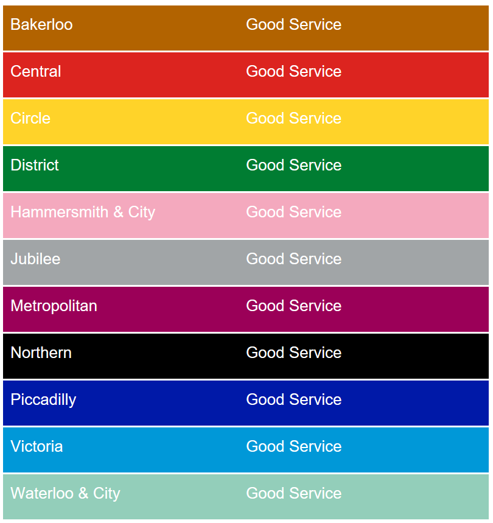

# TFL Status Project

The idea is to use .net core to create a service that fetches the TFL line status and displays it on-screen.

It accesses Transport For London’s API to get the status of all tube lines and displays them to the user. The solution comprises of both a console app and a web app.

### To Run Command Line App

 Clone this repo and download the project files
 Navigate to: TFLStatusProject  TFLStatus and run dotnet run -a from the command line

### To Run Web App

 Navigate to: TFLStatusProject  TFLStatusWeb and run dotnet run from the command line
 
 Sample screenshot of the Web App:
 
 
 
### Class Library
 
At its base, the project has a class library that provides the methods through which it can access TFL’s Api. It returns a JSON file containing all tube line information and maps it to an object of relevant information. It is this object that the class library passes to either the Command Line App or the Web App.

### Key Design Choices
1.	Use of HttpClient- We use this library to make our requests to the API. It provides us with all the necessary functionality and online documentation was extensive. Although more expansive libraries are available chose to implement our own interfaces and wrappers, as opposed to being given them out of the box.
2.	Use of interfaces and wrappers- We make extensive use of interfaces and wrappers throughout the program to ensure that we could fully test our methods and ensure proper dependency injection.
3.	Use of IoC Container- This allowed us to introduce all required class instances at start up, the program would then use these as required. This reduced repetition and helped to ensure proper dependency of injection.

